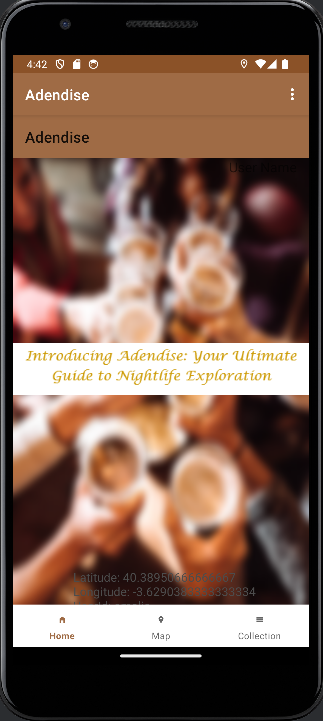
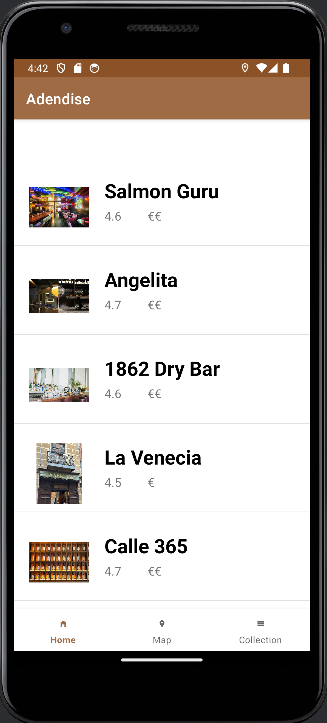
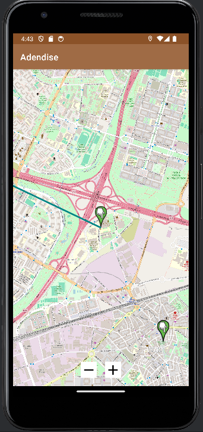
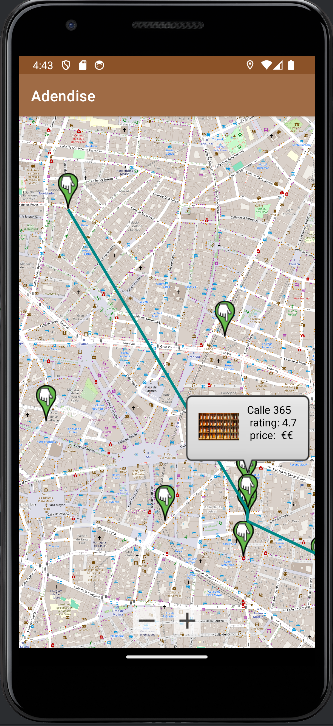

# Adendise

## Workspace 
Github:  
- Repository: https://github.com/amaliaadetu/MobileAppDev   
- Releases: https://github.com/amaliaadetu/MobileAppDev/releases

Workspace: https://upm365.sharepoint.com/sites/Adendise/SitePages/CollabHome.aspx
  

## Description
"Adendise" is a convenient app designed for nightlife enthusiasts in Madrid. It offers a curated list of the city's most popular bars, allowing users to explore and select their preferred destinations effortlessly. Once a user selects the bars they want to visit, the app generates the optimal route between them, ensuring a seamless and enjoyable bar-hopping experience. With its user-friendly interface and smart routing feature, "Adendise" makes exploring the vibrant nightlife of Madrid both convenient and exciting. 
Unlike generic travel apps, "Adendise" offers specialized features tailored to the nightlife scene, providing an immersive experience for users looking to explore Madrid's vibrant nightlife.

## Screenshots and navigation

<table>
  <tr>
    <td>
      
      
Home page

    </td>
    <td>
      
      
List of bars

    </td>
  </tr>
  <tr>
    <td>
      
      
The process of selecting bars

    </td>
    <td>
      
      
The map

    </td>
  </tr>
  <tr>
    <td>
      
      
The route based on the selected bars

    </td>
    <td>
    </td>
  </tr>
</table>

## Demo Video
  

## Features

- List of most popular bars in Madrid.
- Creation of optimal route.
- Reconfiguration of route.

List the **technical** features of the app:
- Persistence in csv
- Persistence in shared preferences
- Firebase authentication
- Maps: Openstreetmaps
- Menu: Bottom Navigation Bar

## How to Use
The users start from the home page, where they can see the bottom navigation bar. They can enter the map to see where the bars in our list are located, or go directly to the list in order to choose their preferences. Once they have made the selection, they go to the map and they can see the route that was created. If they want to add or delete any bar, they can slide back to the list, make the change, and go back to the map. The route begins from their current location.

## Participants
- Adetu Amalia (amaliaioana.adetu@alumunos.upm.es)
- Emile Marchandise (emile.marchandise@alumunos.upm.es)  

